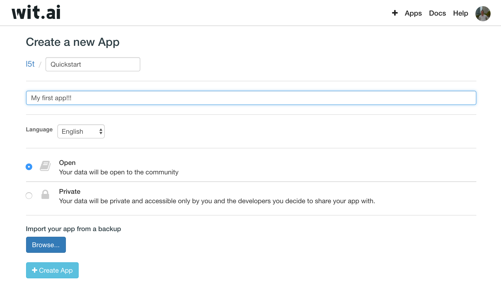
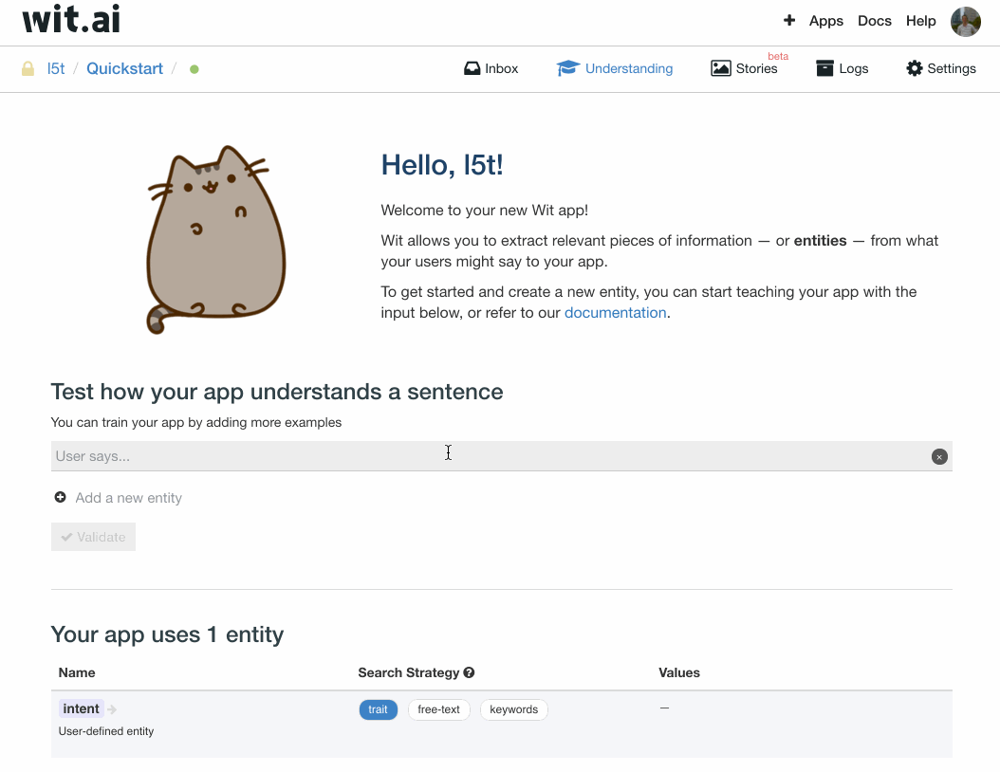
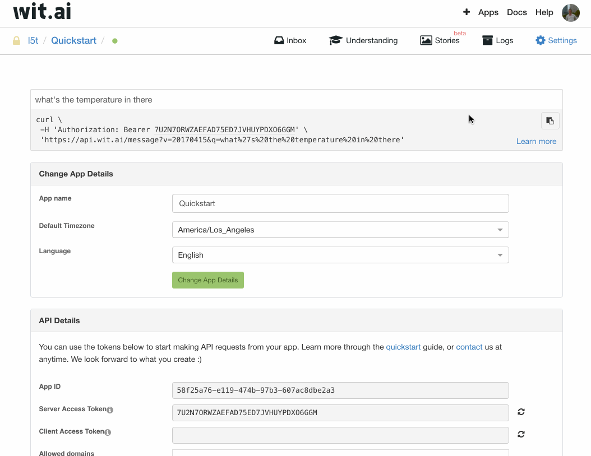
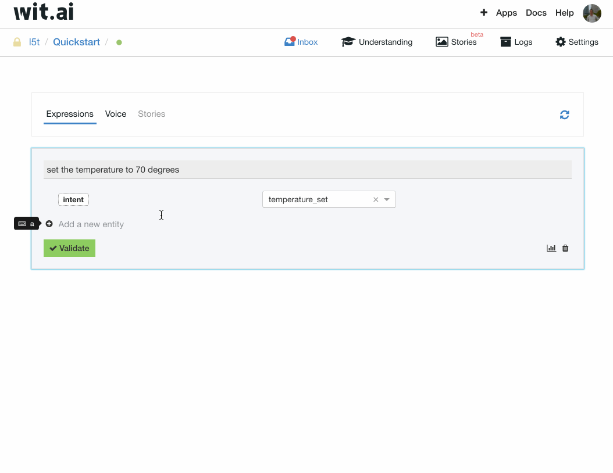

# Wit.ai-E-Portfolio
All files for my E-Portfolio of the Software Engineering lecture can be found here.

## Slides

The slides can be found in the folder [Documentation](documentation).

## Cheat Sheet
Take a look at wit.ai's documentation:

 - [Recipes](https://wit.ai/docs/recipes)

 - [HTTP API](https://wit.ai/docs/http/20170307)
 
## Tutorial

This tutorial will guide you through the process of creating an wit.ai app and using java to query it.

### Step 1 - Log in

Head to [wit.ai](https://wit.ai/) and log in with your GitHub account.
Follow the instructions until you see the welcome page of your app.

### Step 2 - Create your app

### Step 3 - Detect you first entity

### Step 4 - Improve detection

### Step 5 - Query your app

### Step 6 - Add a new entity value

### Step 7 - Capture more

